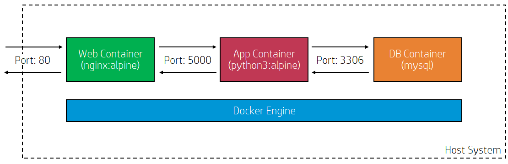

# Best Songs (Docker)

Project to demonstrate using Docker to:
* Build nginx:alpine web container that acts as reverse proxy and forwards requests to application server
* Build python3:alpine app container that deploys python code to query random random song from [list of 100 songs](http://www.johnsandford.org/prey16x1.html) store in mysql database
* Use docker-compose to build app, web and database containers and expose port 80 to host system



## Prerequisites
* Docker installed and configured OR a node on [Play with Docker](https://labs.play-with-docker.com/)

## Cloning this project from github
```
git clone https://github.com/skipluck/bestsongs-docker
```
### Change file permissions (only for Play with Docker)
```
chmod 644 /root/bestsongs-docker/db/dbdump.sql
```
## Executing Docker Componse
```
cd bestsongs-docker
docker-compose up -d
```

## Using curl to test
```
curl localhost
```
run the command again to display a different random song

## Testing via browser
Launch browser on host system and naviate to ```http://localhost```. Refresh the page to display a different random song

### Testing on Play with Docker
Launch browser on host system and use the following URL pattern ```http://ip<hyphen-ip>-<session_jd>-<port>.direct.labs.play-with-docker.com``` (i.e: http://ip172-18-0-10-bc23mf7ndhl000d01gm0.direct.labs.play-with-docker.com/). Refresh the page to display a different random song

## Stopping the application
```
docker-compose stop
```